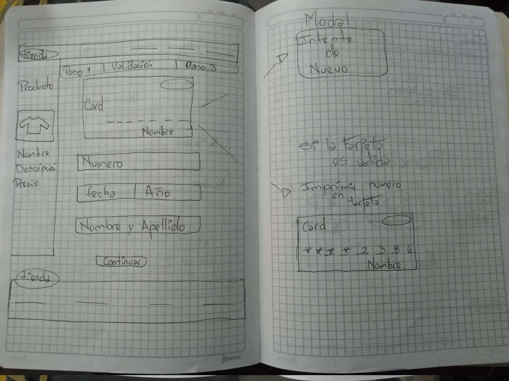
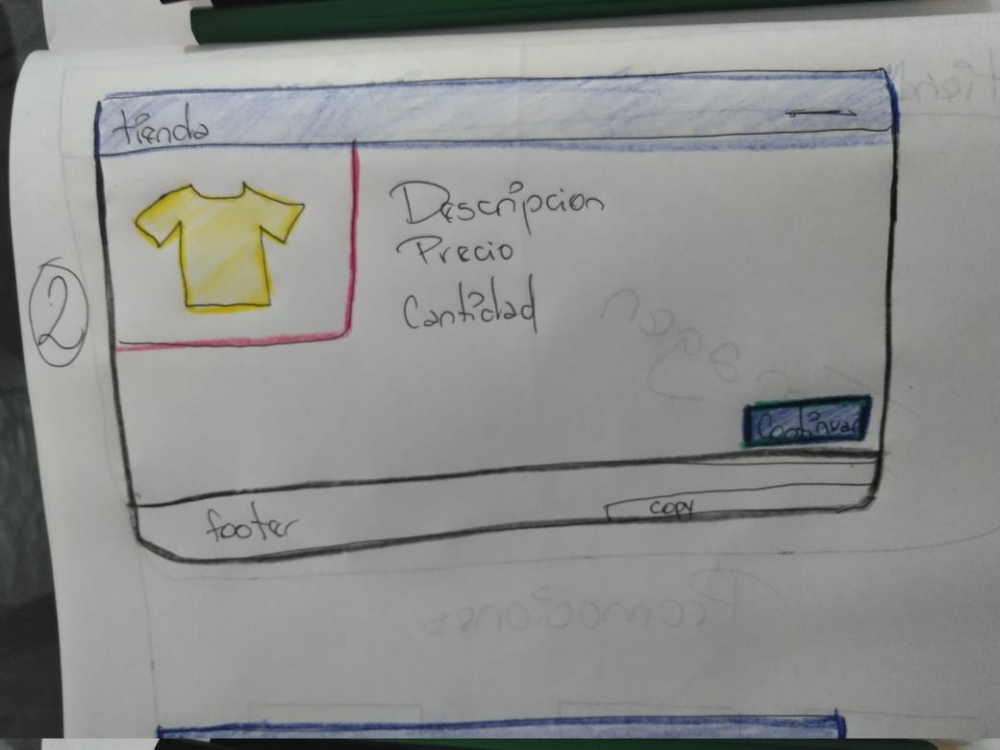

# Tarjeta de credito valida

## Definicion

Tienda de chaquetas online.
 
YOUR OWN STYLE

Diseñamos la pagina web pensando en la comodidad de las mujeres, para que puedan comprar sin salir de casa, le aseguramos una compra segura al poder escoger el metodo de pago de su preferencia.

## Investigacion UI

Nuestros principales usuarios son mujeres. Cuyo principal ojetivo es comprar desde la comodidad de su casa, teniendo la seguridad de que el producto llegara hasta el lugar donde se encuentren.

## Investigacion UX

###Prototipo 1

###Prototipo 2

###Prototipo Final

## Objetivos de aprendizaje

### UX

* [x] Diseñar la aplicación pensando y entendiendo al usuario
* [x] Crear prototipos para obtener feedback e iterar
* [ ] Aplicar los principios de diseño visual

### HTML y CSS

* [ ] Uso correcto de HTML semántico
* [x] Uso de selectores de CSS
* [x] Construir tu aplicación respetando el diseño realizado (maquetación).

### DOM

* [x] Uso de selectores de nodos del DOM
* [x] Manejo de eventos del DOM
* [x] Manipulación dinámica del DOM

### Javascript

* [x] Manipulación de strings
* [x] Uso de condicionales
* [x] Uso de bucles
* [x] Uso de funciones
* [ ] Datos atómicos y estructurados
* [x] Utilizar ES Modules (`import` | `export`).

### Testing

* [x] [Testeo de tus funciones](https://jestjs.io/docs/es-ES/getting-started)

### Git y GitHub

* [x] Comandos de git (`add` | `commit` | `pull` | `status` | `push`).
* [x] Manejo de repositorios de GitHub (`clone` | `fork` | `gh-pages`).

### Buenas prácticas de desarrollo

* [ ] Organizar y dividir el código en módulos (Modularización).
* [ ] Uso de identificadores descriptivos (Nomenclatura | Semántica).
* [ ] Uso de linter para seguir buenas prácticas (ESLINT).